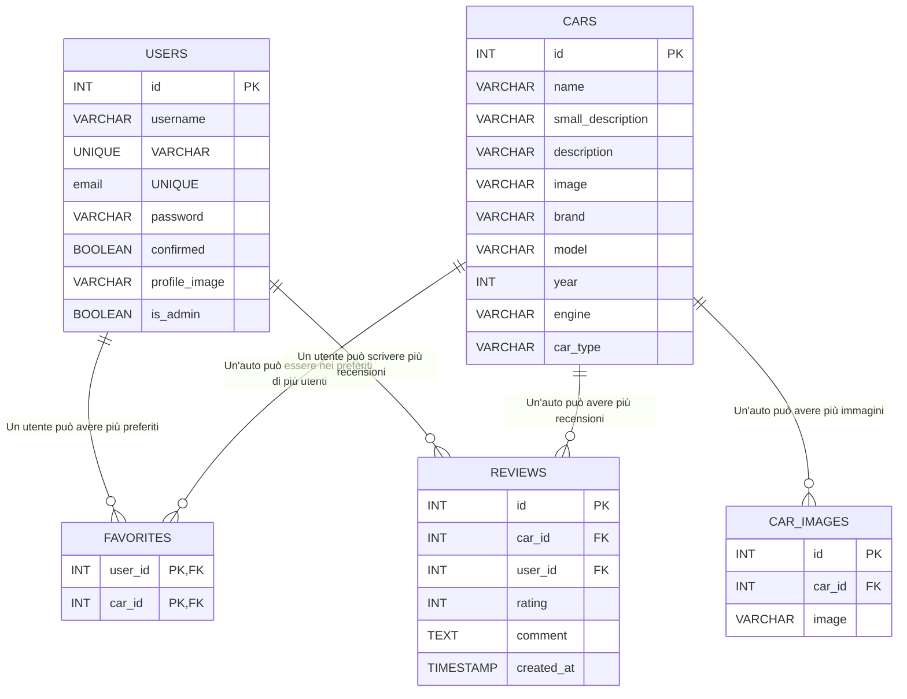

# wikisportcars/wikisportcars/README.md

# WikiSportCars

WikiSportCars è un'applicazione web che permette agli utenti di esplorare una vasta gamma di automobili sportive, visualizzare dettagli, immagini, recensioni e salvare le auto preferite. Alcune funzionalità richiedono la registrazione e il login.

## Funzionalità principali
- Visualizzazione elenco auto sportive
- Dettagli e immagini di ogni auto
- Registrazione e login utenti
- Salvataggio auto nei preferiti
- Recensioni e valutazioni sulle auto

## Struttura del database

Vedi il diagramma ER qui sotto:



Legenda:
- PK = Primary Key
- FK = Foreign Key
- UNIQUE = Unico

## Struttura del progetto
- `templates/`: File HTML delle pagine
- `static/`: File statici (CSS, JS)
- `app.py`: Logica principale e routing
- `config.py`: Configurazione database
- `requirements.txt`: Dipendenze Python
- `wikisportcars.sql`: Script per la creazione del database

## Descrizione delle cartelle e dei file principali

- `app.py` / `server.py`: Logica principale dell'applicazione Flask, routing e gestione delle richieste.
- `config.py` / `db_config.py`: Configurazione della connessione al database MySQL.
- `requirements.txt`: Elenco delle dipendenze Python necessarie per il progetto.
- `wikisportcars.sql`: Script SQL per la creazione e il popolamento del database.
- `wsgi.py`: Entry point per il deploy su server WSGI (es. PythonAnywhere).
- `email_service.py`: Gestione invio email di conferma e recupero password.
- `templates/`: Template HTML Jinja2 per tutte le pagine dell'applicazione (inclusi login, registrazione, profilo, dettaglio auto, admin, ecc).
- `static/`: File statici come CSS, JS, immagini e icone.
    - `css/`: Fogli di stile per layout, autenticazione, profilo, messaggi flash, ecc.
    - `js/`: Script JavaScript per funzionalità dinamiche (login, registrazione, gestione immagini, messaggi flash, ecc).
    - `images/`: Immagini di default, icone, loghi, ecc.

## Dipendenze principali

- Flask
- Flask-Login
- Flask-Mail
- Flask-WTF
- Flask-SQLAlchemy
- mysql-connector-python
- email-validator
- Pillow
- Jinja2
- itsdangerous
- python-dotenv
- gunicorn (per deploy)

Tutte le dipendenze sono elencate in `requirements.txt`.

## Installazione locale

### Prerequisiti
- Python 3.10 o superiore
- MySQL Server installato e in esecuzione
- (Consigliato) Ambiente virtuale Python

### Passaggi
1. **Clona il repository:**
   ```
   git clone <repository-url>
   ```
2. **Vai nella cartella del progetto:**
   ```
   cd wikisportcars
   ```
3. **(Opzionale ma consigliato) Crea e attiva un ambiente virtuale:**
   ```
   python -m venv venv
   # Su Windows:
   venv\Scripts\activate
   # Su Mac/Linux:
   source venv/bin/activate
   ```
4. **Installa le dipendenze:**
   ```
   pip install -r requirements.txt
   ```
5. **Crea il database MySQL:**
   - Avvia MySQL e crea un database (es: `wikisportcars`).
   - Importa lo script `wikisportcars.sql` tramite client MySQL o phpMyAdmin:
     ```
     mysql -u <user> -p <nome_database> < wikisportcars.sql
     ```
6. **Configura la connessione al database:**
   - Modifica `config.py` o `db_config.py` inserendo i parametri del tuo database (host, user, password, nome database).
   - (Opzionale) Usa un file `.env` per gestire le variabili sensibili.
7. **Avvia l'applicazione:**
   ```
   python app.py
   ```
   oppure
   ```
   python server.py
   ```
8. **Apri il browser su** `http://localhost:5000`

---

## Deploy su PythonAnywhere

### Prerequisiti
- Account su [pythonanywhere.com](https://www.pythonanywhere.com/)
- Tutti i file del progetto caricati (via Git o upload manuale)

### Passaggi
1. **Crea un nuovo database MySQL** tramite la dashboard di PythonAnywhere.
2. **Aggiorna i parametri di connessione** in `config.py` o `db_config.py` con i dati forniti da PythonAnywhere.
3. **Importa lo script SQL** nel database tramite la console MySQL di PythonAnywhere:
   ```
   mysql -u <user> -p -h <host> <nome_database> < wikisportcars.sql
   ```
4. **Crea un virtualenv** e installa le dipendenze:
   ```
   mkvirtualenv --python=python3.8 wikisportcars-venv
   pip install -r requirements.txt
   ```
5. **Configura la Web App:**
   - Scegli "Manual configuration" e Python 3.x.
   - Imposta il percorso del file `wsgi.py` come entry point.
   - Aggiungi le variabili d’ambiente necessarie (es: credenziali DB, secret key, email, ecc).
   - Nella sezione "Static files", mappa `/static/` alla cartella `static` del progetto.
6. **Riavvia la Web App** dalla dashboard di PythonAnywhere.

### Note utili
- Se usi variabili d’ambiente, puoi creare un file `.env` e caricarlo tramite `python-dotenv`.
- Per debug, consulta i log di errore nella dashboard PythonAnywhere.
- Assicurati che tutte le dipendenze siano installate nel virtualenv attivo.

---

## Funzionalità avanzate
- Sistema di autenticazione e gestione sessioni utente
- Conferma email e recupero password tramite email
- Dashboard amministratore per gestione auto
- Ricerca e filtri dinamici sulle auto
- Gestione immagini multiple per ogni auto
- Messaggi flash dinamici e interfaccia responsive

## Contribuire
Sono benvenute issue e pull request per migliorare il progetto. Per proporre modifiche:
- Fai un fork del repository
- Crea un branch per la tua feature/fix
- Invia una pull request descrivendo chiaramente le modifiche

Per domande o suggerimenti, apri una issue su GitHub.