# WikiSportCars

WikiSportCars è una enciclopedia web interattiva dedicata al mondo delle automobili sportive, che permette agli appassionati di esplorare un vasto catalogo di vetture iconiche e moderne. La piattaforma offre contenuti dettagliati, gallerie fotografiche, specifiche tecniche e recensioni della community, creando un'esperienza completa per gli amanti dei motori.

## Caratteristiche principali

- **Catalogo completo**: Ampia selezione di auto sportive divise in categorie (Sportive, Supercar, Hypercar, Berline, Muscle Car, GT, Utilitarie)
- **Schede dettagliate**: Ogni auto presenta descrizione approfondita, specifiche tecniche e galleria fotografica
- **Sistema di ricerca avanzato**: Ricerca per nome, marca, modello con filtri per categoria
- **Valutazioni e recensioni**: Sistema di rating a stelle e possibilità di lasciare recensioni dettagliate
- **Area personale**: Profilo utente personalizzabile con foto e gestione dei preferiti
- **Interfaccia responsive**: Design moderno e funzionale ottimizzato per tutti i dispositivi

## Area utenti

- Registrazione con conferma via email
- Login sicuro con recupero password
- Profilo personalizzabile con immagine
- Salvataggio auto preferite
- Possibilità di recensire e valutare i veicoli

## Area amministrativa

- Pannello di controllo per la gestione del catalogo
- Strumenti per aggiungere, modificare ed eliminare schede auto
- Gestione delle immagini multiple per ogni veicolo
- Supervisione delle recensioni degli utenti

## Tecnologie utilizzate

Sviluppato con tecnologie moderne e robuste:
- Backend: Python con framework Flask
- Database: MySQL
- Frontend: HTML5, CSS3, JavaScript
- Autenticazione: Flask-Login con conferma email

## Sviluppi futuri

Il progetto è in continua evoluzione, con diversi miglioramenti previsti nelle prossime versioni:

### Interfaccia grafica
- Ridesign completo della homepage con layout più moderno e intuitivo
- Miglioramento della visualizzazione su dispositivi mobili
- Implementazione di un tema scuro/chiaro selezionabile dall'utente
- Ottimizzazione delle gallerie fotografiche con migliore gestione delle immagini


### Usabilità
- Miglioramento dei form con validazione più intuitiva
- Ottimizzazione dei tempi di caricamento delle pagine

Questi miglioramenti sono parte della roadmap di sviluppo e saranno implementati progressivamente nelle prossime release.

## Struttura del database

Vedi il diagramma ER qui sotto:

```mermaid
erDiagram
    USERS {
        INT id PK
        VARCHAR username UNIQUE
        VARCHAR email UNIQUE
        VARCHAR password
        BOOLEAN confirmed
        VARCHAR profile_image
        BOOLEAN is_admin
    }
    CARS {
        INT id PK
        VARCHAR name
        VARCHAR small_description
        VARCHAR description
        VARCHAR image
        VARCHAR brand
        VARCHAR model
        INT year
        VARCHAR engine
        VARCHAR car_type
    }
    CAR_IMAGES {
        INT id PK
        INT car_id FK
        VARCHAR image
    }
    FAVORITES {
        INT user_id PK, FK
        INT car_id PK, FK
    }
    REVIEWS {
        INT id PK
        INT car_id FK
        INT user_id FK
        INT rating
        TEXT comment
        TIMESTAMP created_at
    }
    USERS ||--o{ FAVORITES : "Un utente può avere più preferiti"
    CARS ||--o{ FAVORITES : "Un'auto può essere nei preferiti di più utenti"
    USERS ||--o{ REVIEWS : "Un utente può scrivere più recensioni"
    CARS ||--o{ REVIEWS : "Un'auto può avere più recensioni"
    CARS ||--o{ CAR_IMAGES : "Un'auto può avere più immagini"
```



Legenda:
- PK = Primary Key
- FK = Foreign Key

## Struttura del progetto
- `templates/`: File HTML delle pagine
- `static/`: File statici (CSS, JS)
- `app.py`: Logica principale e routing
- `config.py`: Configurazione database
- `requirements.txt`: Dipendenze Python
- `wikisportcars.sql`: Script per la creazione del database

## Descrizione delle cartelle e dei file principali

- `app.py` / `server.py`: Logica principale dell'applicazione Flask, routing e gestione delle richieste.
- `config.py` / `db_config.py`: Configurazione della connessione al database MySQL.
- `requirements.txt`: Elenco delle dipendenze Python necessarie per il progetto.
- `wikisportcars.sql`: Script SQL per la creazione e il popolamento del database.
- `wsgi.py`: Entry point per il deploy su server WSGI (es. PythonAnywhere).
- `email_service.py`: Gestione invio email di conferma e recupero password.
- `templates/`: Template HTML Jinja2 per tutte le pagine dell'applicazione (inclusi login, registrazione, profilo, dettaglio auto, admin, ecc).
- `static/`: File statici come CSS, JS, immagini e icone.
    - `css/`: Fogli di stile per layout, autenticazione, profilo, messaggi flash, ecc.
    - `js/`: Script JavaScript per funzionalità dinamiche (login, registrazione, gestione immagini, messaggi flash, ecc).
    - `images/`: Immagini di default, icone, loghi, ecc.

## Dipendenze principali

- Flask
- Flask-Login
- Flask-Mail
- mysql-connector-python
- Jinja2
- itsdangerous

Tutte le dipendenze sono elencate in `requirements.txt`.

## 🔧 Configurazione e Setup

### 🔒 Sistema di Configurazione Sicuro

Il progetto utilizza un sistema di configurazione avanzato che separa le informazioni sensibili da quelle pubbliche:

- **`config.ini`**: Configurazioni pubbliche (committate su GitHub)
- **`.env`**: Credenziali sensibili (mai committate)
- **`.env.example`**: Template per sviluppatori

### Prerequisiti
- Python 3.10 o superiore
- MySQL Server installato e in esecuzione
- (Consigliato) Ambiente virtuale Python

### Setup Rapido per Sviluppatori

1. **Clona il repository:**
   ```bash
   git clone <repository-url>
   cd wikisportcars
   ```

2. **Crea ambiente virtuale e installa dipendenze:**
   ```bash
   python -m venv venv
   source venv/bin/activate  # Linux/Mac
   # oppure
   venv\Scripts\activate     # Windows
   pip install -r requirements.txt
   ```

3. **⚠️ IMPORTANTE - Configura le credenziali:**
   ```bash
   # Copia il template delle credenziali
   cp .env.example .env
   
   # Modifica .env con le tue credenziali reali
   nano .env  # o usa il tuo editor preferito
   ```

4. **Configura il database MySQL(solo in locale):**
   ```bash
   # Importa lo schema
   mysql -u root -p wikisportcars < wikisportcars.sql
   ```

5. **Aggiorna le credenziali nel file .env:**
   ```bash
   # Esempio configurazione .env
   DB_PASSWORD_LOCAL=la_tua_password_mysql
   FLASK_SECRET_KEY=genera_una_chiave_casuale_molto_lunga
   EMAIL_USER=tua_email@gmail.com
   EMAIL_PASSWORD=password_app_gmail
   ```

6. **Avvia l'applicazione:**
   ```bash
   python server.py
   ```

7. **Accedi su** `http://localhost:5000`

### 📋 Configurazioni Specifiche

#### File `.env` (Credenziali Sensibili)
```bash
# Database Passwords
DB_PASSWORD_LOCAL=la_tua_password_mysql
DB_PASSWORD_PYTHONANYWHERE=password_pythonanywhere

# Flask Security Keys (GENERA CHIAVI RANDOM!)
FLASK_SECRET_KEY=chiave_segreta_molto_lunga_e_casuale
SECURITY_PASSWORD_SALT=salt_casuale_per_sicurezza

# Email Configuration
EMAIL_USER=tua_email@gmail.com
EMAIL_PASSWORD=password_app_specifica_gmail

# Admin Configuration
ADMIN_EMAIL=admin@tuodominio.com
ADMIN_PASSWORD=password_admin_sicura
```

#### File `config.ini` (Configurazioni Pubbliche)
Le configurazioni non sensibili sono già nel file `config.ini` e possono essere modificate secondo necessità:
- Host e nomi database
- Configurazioni email (server, porta)
- Impostazioni Flask
- Percorsi e sicurezza

### 👑 Account Amministratore

Il sistema crea automaticamente un account admin:
- **Email**: Configurabile nel file `.env` (`ADMIN_EMAIL`)
- **Password**: Configurabile nel file `.env` (`ADMIN_PASSWORD`)

Per accedere all'area admin: `/login` → inserisci credenziali admin → vai su `/admin`

---

## 🚀 Deploy su PythonAnywhere

### Prerequisiti
- Account su [pythonanywhere.com](https://www.pythonanywhere.com/)
- Repository clonato su PythonAnywhere (via Git consigliato)

### Setup Sicuro per Produzione

1. **Clona il repository su PythonAnywhere:**
   ```bash
   git clone <repository-url>
   cd wikisportcars
   ```

2. **Configura le credenziali di produzione:**
   ```bash
   # Crea il file .env per produzione
   cp .env.example .env
   
   # Modifica con le credenziali di PythonAnywhere
   nano .env
   ```

3. **Aggiorna .env per PythonAnywhere:**
   ```bash
   # Credenziali database PythonAnywhere
   DB_PASSWORD_PYTHONANYWHERE=password_db_pythonanywhere
   
   # Chiavi di produzione (GENERA NUOVE CHIAVI SICURE!)
   FLASK_SECRET_KEY=chiave_produzione_molto_sicura_e_lunga
   SECURITY_PASSWORD_SALT=salt_produzione_sicuro
   
   # Email di produzione
   EMAIL_USER=email_produzione@tuodominio.com
   EMAIL_PASSWORD=password_email_produzione
   
   # Admin di produzione
   ADMIN_EMAIL=admin@tuodominio.com
   ADMIN_PASSWORD=password_admin_produzione
   ```

4. **Crea un nuovo database MySQL** tramite la dashboard di PythonAnywhere.

5. **Importa lo script SQL** nel database tramite la console MySQL di PythonAnywhere:
```sql
DROP DATABASE IF EXISTS wikisportcars;

CREATE DATABASE wikisportcars;
USE wikisportcars;

DROP TABLE IF EXISTS `users`;
-- Struttura della tabella `users`
CREATE TABLE IF NOT EXISTS `users` (
  `id` INT AUTO_INCREMENT PRIMARY KEY,
  `username` VARCHAR(100) UNIQUE NOT NULL,
  `email` VARCHAR(100) UNIQUE NOT NULL,
  `password` VARCHAR(255) NOT NULL,
  `confirmed` BOOLEAN DEFAULT 0,
  `profile_image` VARCHAR(255) DEFAULT NULL,
  `is_admin` BOOLEAN DEFAULT 0
) ENGINE=InnoDB DEFAULT CHARSET=utf8mb4 COLLATE=utf8mb4_general_ci;

-- Inserisco un utente admin predefinito
INSERT INTO `users` (`username`, `email`, `password`, `confirmed`, `is_admin`) VALUES 
('admin', 'admin@example.com', 'pbkdf2:sha256:260000$7prJAiX6jHkAr75C$b0d3ff8cc49e3d1e1f2e9d0a80d8341c9d3f3c86ab0ca66c15c9f1e6a7c6b4f4', 1, 1);
-- Password: admin123

DROP TABLE IF EXISTS `cars`;
CREATE TABLE cars (
    id INT AUTO_INCREMENT PRIMARY KEY,
    name VARCHAR(100) NOT NULL,
    small_description VARCHAR(100) NOT NULL,
    description VARCHAR(10000) NOT NULL,
    image VARCHAR(1024) NOT NULL,
    brand VARCHAR(100) NOT NULL,
    model VARCHAR(100) NOT NULL,
    year INT,
    engine VARCHAR(100) NOT NULL,
    car_type VARCHAR(50) NOT NULL
);

INSERT INTO cars (id, name, small_description, description, image, brand, model, year, engine, car_type) VALUES
(1, 'Corvette C6', 'Macchina sportiva americana Muscle con motore V8',
 'La Corvette C6 rappresenta una combinazione perfetta tra tradizione e innovazione nella cultura automobilistica americana. Questa vettura è famosa per il suo design aggressivo e muscoloso, accompagnato da un potente motore V8 capace di erogare prestazioni eccezionali sia in pista che su strada. La C6 è stata progettata per offrire un’esperienza di guida intensa, mantenendo al contempo un comfort elevato per un uso quotidiano. Un’icona del design americano, che continua a incantare gli appassionati di automobile con il suo fascino intramontabile.',
 'https://upload.wikimedia.org/wikipedia/commons/9/99/2003_Chevrolet_Corvette_C6_%284794073538%29_%28cropped%29.jpg',
 'Chevrolet Corvette', 'C6', 2003, 'V8', 'Muscle'),

(2, 'Ferrari 458', 'Macchina sportiva italiana con motore V8',
 'La Ferrari 458 incarna il meglio dell’ingegneria italiana, unendo prestazioni mozzafiato a un design elegante ed aerodinamico. Ogni linea della 458 è studiata per ottimizzare la velocità e l’efficienza, mantenendo però un’inconfondibile raffinatezza. Il suo motore V8, affiancato da una tecnologia di ultima generazione, offre una guida reattiva e coinvolgente, facendo di questa supercar una scelta ideale sia per la pista che per chi desidera il massimo dal piacere di guida.',
 'https://images.ctfassets.net/uaddx06iwzdz/1qzdgJF4iYltZDsb6tOpLW/d44cbcf8ec3cb959494ac40c36d48a07/ferrari-458-italia-side.jpeg',
 'Ferrari', '458', 2009, 'V8', 'Supercar'),

(3, 'Porsche 911', 'Macchina sportiva tedesca con motore 6 cilindri',
 'La Porsche 911 è una leggenda del mondo delle auto sportive, celebre per il suo design senza tempo e la perfetta sinergia tra tradizione e innovazione. Dotata di un motore a 6 cilindri, la 911 offre un equilibrio impeccabile tra potenza, maneggevolezza e raffinatezza. Ogni dettaglio, dalla silhouette aerodinamica al sofisticato interno, è stato progettato per garantire una guida dinamica e coinvolgente, rendendo ogni esperienza al volante un vero piacere.',
 'https://img.autoabc.lv/Porsche-911/Porsche-911_2011_Kupeja_231232737_4.jpg',
 'Porsche', '911', 2011, '6 cilindri', 'GT'),

(4, 'Lamborghini Huracan', 'Macchina sportiva italiana con motore V10',
 'La Lamborghini Huracan rappresenta l’avanguardia del design e della tecnologia italiana nel segmento delle supercar. Con il suo motore V10 e linee audaci e dinamiche, la Huracan offre prestazioni estreme e un’esperienza di guida unica. Ogni curva e ogni dettaglio sono studiati per garantire aerodinamicità e stabilità, trasformando ogni corsa in un’avventura emozionante e piena di adrenalina.',
 'https://res.cloudinary.com/motortrak/image/upload/t_base_vehicle_transformation/v1706191867/ims2/vehicle-media/ce150f3a37083d090d804866f50f975a/lamborghini-Hurac%C3%A1n%20LP%20610-4-undefined-1/gdpoh2jpq6biwmqbkfu0.webp',
 'Lamborghini', 'Huracan', 2014, 'V10', 'Supercar'),

(5, 'Audi R8', 'Macchina sportiva tedesca con motore V10',
 'L’Audi R8 è il simbolo dell’eccellenza ingegneristica tedesca, capace di coniugare lusso, performance e comfort in un’unica vettura. Il suo motore V10 garantisce accelerazioni fulminee, mentre il design sofisticato e le tecnologie all’avanguardia offrono una guida tanto reattiva quanto raffinata. La R8 è stata progettata per conquistare sia le strade urbane sia le piste di gara, offrendo un’esperienza di guida completa e innovativa.',
 'https://mrsportscars.com/wp-content/uploads/2017/09/Audi-R8-2006-Photo-31.jpg',
 'Audi', 'R8', 2006, 'V10', 'Supercar'),

(6, 'Nissan GT-R35', 'Macchina sportiva giapponese con motore V6',
 'La Nissan GT-R35 è sinonimo di tecnologia avanzata e prestazioni straordinarie, considerata tra le supercar giapponesi più innovative. Il suo motore V6, abbinato a un sofisticato sistema di trazione integrale, offre un’esperienza di guida dinamica e altamente reattiva. Con un design che unisce funzionalità ed estetica, la GT-R35 è stata progettata per dominare sia su strada che in pista, rappresentando una vera rivoluzione nell’automobilismo moderno.',
 'https://upload.wikimedia.org/wikipedia/commons/b/ba/Nissan_GT-R_01.JPG',
 'Nissan', 'GT-R35', 2007, 'V6', 'GT'),

(7, 'McLaren 720S', 'Macchina sportiva inglese con motore V8',
 'La McLaren 720S è una supercar britannica che unisce un design futuristico a prestazioni eccezionali. Realizzata con materiali leggeri e all’avanguardia, la 720S offre una dinamica di guida rivoluzionaria, grazie al suo motore V8 che eroga una potenza impressionante. Ogni dettaglio, dalle linee scolpite al sistema aerodinamico, è stato studiato per garantire massima efficienza e un’esperienza di guida emozionante e senza compromessi.',
 'https://www.supervettura.com/blobs/Cars/145/f81da39b-a5c6-4f2c-a56f-a6515ec0984f.jpg?width=1920&height=1080&mode=crop',
 'McLaren', '720S', 2017, 'V8', 'Supercar'),

(8, 'Bugatti Veyron', 'Macchina sportiva francese con motore W16',
 'La Bugatti Veyron è una delle hypercar più iconiche al mondo, un capolavoro dell’ingegneria francese che unisce potenza estrema e lusso ineguagliabile. Dotata di un motore W16, la Veyron è in grado di raggiungere velocità incredibili mantenendo un comfort e una stabilità sorprendenti. Il suo design esclusivo, caratterizzato da eleganza e innovazione, la rende un simbolo di prestigio e tecnologia all’avanguardia.',
 'https://www.auto-data.net/images/f7/Bugatti-EB-Veyron-16.4-Coupe.jpg',
 'Bugatti', 'Veyron', 2005, 'W16', 'Hypercar'),

(9, 'Koenigsegg Agera', 'Macchina sportiva svedese con motore V8',
 'La Koenigsegg Agera è un esempio estremo di ingegneria automobilistica svedese, progettata per spingere i limiti delle performance e del design. Questa hypercar, dotata di un motore V8, offre accelerazioni fulminee e una dinamica di guida che rompe ogni convenzione. Con la sua estetica minimalista e sofisticata, l’Agera rappresenta l’evoluzione della tecnologia sportiva in ogni suo dettaglio.',
 'https://www.supervettura.com/blobs/Cars/69/c46edc49-82fe-4aca-bf90-9f8719bde185.jpg?width=1920&height=1080&mode=crop',
 'Koenigsegg', 'Agera', 2011, 'V8', 'Hypercar'),

(10, 'Pagani Huayra', 'Macchina sportiva italiana con motore V12',
 'La Pagani Huayra è l’emblema dell’eleganza e della maestria artigianale italiana, unendo il meglio del design e della tecnologia in una supercar che è autentica opera d’arte. Dotata di un potente motore V12, la Huayra offre prestazioni straordinarie accompagnate da una guida fluida e carismatica. Ogni elemento, dalle finiture interne in materiali pregiati fino alle linee esterne scolpite, è studiato per creare un equilibrio perfetto tra bellezza e potenza.',
 'https://www.autocar.co.uk/sites/autocar.co.uk/files/pagani-2511111948565911600x1060_0.jpg',
 'Pagani', 'Huayra', 2012, 'V12', 'Hypercar'),

(11, 'Opel Corsa', '4 Cilindri in linea 1.2 Benzina', "La Opel Corsa 1.2 benzina del 2018 è una city car a 5 porte, ideale 
per l’uso urbano grazie alle dimensioni compatte e al motore 1.2 aspirato da 70 CV. Offre consumi contenuti (circa 5,5–6 l/100 km), buona affidabilità e dotazioni
essenziali come climatizzatore, radio Bluetooth e sistemi di sicurezza di base. Con un bagagliaio da 285 litri e un abitacolo confortevole, è una scelta pratica 
per chi cerca un’auto economica e funzionale e ideale per Neopatentati.     e per chi piace l'Opel :)",
'https://www.federmetano.it/wp-content/uploads/2018/04/opel-corsa-1-2.jpg','Opel', 'Corsa', 2018, '4 cilindri in linea', 'Utilitaria'),

(12, 'BMW Serie 5', 'Berlina tedesca elegante e confortevole',
 'La BMW Serie 5 è una delle berline più apprezzate al mondo, famosa per il suo equilibrio tra comfort, tecnologia e piacere di guida. Offre interni spaziosi, materiali di alta qualità e una gamma di motorizzazioni efficienti. Ideale sia per viaggi di lavoro che per la famiglia, la Serie 5 rappresenta il perfetto connubio tra eleganza e prestazioni.',
 'https://www.reportmotori.it/wp-content/uploads/2020/05/BMW-5-Series-2021-12-610x349.jpg',
 'BMW', 'Serie 5', 2021, '4 cilindri turbo', 'Berlina'),

(13, 'Mazda MX-5', 'Roadster sportiva compatta giapponese',
 'La Mazda MX-5 è una delle sportive più iconiche e amate, celebre per la sua leggerezza, agilità e puro divertimento di guida. Con trazione posteriore, motore 4 cilindri e tetto apribile, la MX-5 offre un’esperienza di guida coinvolgente e autentica, perfetta per chi cerca emozioni su strada senza compromessi.',
 'https://www.motortrend.com/uploads/2022/11/2023-Mazda-MX-5-RF-Club-front-three-quarter-view-25.jpg?w=768&width=768&q=75&format=webp',
 'Mazda', 'MX-5', 2023, '4 cilindri', 'Sportiva');

CREATE TABLE car_images (
    id INT AUTO_INCREMENT PRIMARY KEY,
    car_id INT,
    image VARCHAR(1024) NOT NULL,
    FOREIGN KEY (car_id) REFERENCES cars(id)
);

INSERT INTO car_images (car_id, image) 
VALUES 
(1, 'https://extremeonlinestore.com/cdn/shop/files/FLIP-199-ABS_SS-080-ABS_SPOILER_218_ABS-HD-28_1400x.jpg?v=1743813788'),
(1, 'https://prod.pictures.autoscout24.net/listing-images/371eda98-9e26-4830-8020-e02e5d53f945_25712121-81eb-4913-8e92-48f42f7e9784.jpg/1280x960.webp'),
(1, 'https://prod-01-loadandpay-media.s3.eu-west-1.amazonaws.com/medias/cache/app_auction_slides_thumb/616802750f6c6332789666.jpg'),
(2, 'https://www.autoscout24.it/cms-content-assets/2kNB9B2UWSOJMfdLiCsn7u-0f66f5f33762f0ffbfee88bef76a5cfb-ferrari-458-italia-back-1100.jpeg'),
(2, 'https://www.autoscout24.it/cms-content-assets/6WYtZ8Kj5mO5QNBwcnCFpv-e23737ee3525530297d8ff37ec60840b-ferrari-458-italia-interior-1100.jpeg'),
(2, 'https://upload.wikimedia.org/wikipedia/commons/6/63/Ferrari_458_Italia_engine.jpg'),
(3, 'https://www.stuttcars.com/wp-content/uploads/2021/11/PORSCHE-911-Carrera-S-997-3811_16.jpeg'),
(3, 'https://res.cloudinary.com/unix-center/image/upload/c_limit,dpr_3.0,f_auto,fl_progressive,g_center,h_580,q_75,w_906/k6cuo7msynqzvbc30sd6.jpg'),
(3, 'https://img.stcrm.it/images/1202406/HOR_STD/800x/5-porsche-911-gt3-rs-4-0-2011-2.jpeg'),
(4, 'https://www.sportal.it/wp-content/uploads/2024/05/lamborghini_1232772Photogallery.jpg'),
(4, 'https://areamotori.files.wordpress.com/2017/03/lamborghini-huracan-performante-2017-interior2.jpg'),
(4, 'https://www.cataloge.eu/media/lamborghini/7/it/lamborghini-huracan-evo-2020-motore.jpg'),
(5, 'https://upload.wikimedia.org/wikipedia/commons/thumb/a/ae/2007_Audi_R8_02.JPG/1200px-2007_Audi_R8_02.JPG'),
(5, 'https://img.stcrm.it/images/1188062/HOR_STD/800x/5-audi-r8-v8-4-2-2007-11-2.jpeg'),
(5, 'https://media.motorbox.com/image/5/0/7/50787/50787-16x9-lg.jpg'),
(6, 'https://www.cataloge.eu/media/nissan/30/it/thumbs-500/nissan-gt-r-r35-2009-1.jpg'),
(6, 'https://images.ctfassets.net/uaddx06iwzdz/woy7Qma4jGO2SSAbcZ3rL/37bea23352d8ac17d77ffbef4f639a04/nissan-gtr-l-04.jpg'),
(6, 'https://cdn.motor1.com/images/mgl/bggjWv/s1/nissan-gt-r-nismo-2016.jpg'),
(7, 'https://i.bstr.es/highmotor/2017/05/McLaren-720S-7.jpg'),
(7, 'https://www.automobiledimension.com/photos/interior/mclaren-720s-2017-dashboard.jpg'),
(7, 'https://www.cavallivapore.it/wp-content/uploads/2017/03/McLaren-720S-Motore-2.jpg'),
(8, 'https://cdn.veloce.it/wp-content/uploads/webp/2024/05/bugatti-veyron-3.webp'),
(8, 'https://encrypted-tbn0.gstatic.com/images?q=tbn:ANd9GcQjcKJZnpYiHd5BiKM2aRmkugPrHAtClBcLiw&s'),
(8, 'https://www.autotecnica.org/wp-content/uploads/2015/07/BUG_Veyron_Photo_46.jpg'),
(9, 'https://www.topcarrating.com/koenigsegg/2011-koenigsegg-agera-r-9.jpg'),
(9, 'https://www.supercars.net/blog/wp-content/uploads/2016/01/914168-2.jpg'),
(9, 'https://www.cdn-docs-ck.com/ck_img/zoom/111936/autoart_1_18_koenigsegg_agera_anno_2011_grigio_arg.jpg'),
(10, 'https://www.kessel.ch/immaginiAutoNuove/kes_huayra_bc_2.jpg'),
(10, 'https://www.cavallivapore.it/wp-content/gallery/cache/13153__720x540_pagani-huayra-interni.jpg'),
(10, 'https://blog.euroimportpneumatici.com/wp-content/uploads/2019/08/Pagani-Huayra-BC-Roadster-9.jpg'),
(11, 'https://immagini.alvolante.it/sites/default/files/styles/anteprima_lunghezza_640_jpg/public/serie_auto_galleria/2014/12/opel_corsa_post_0.png'),
(11, 'https://immagini.alvolante.it/sites/default/files/styles/editor_1_colonna/public/news_galleria/2014/07/opel-corsa-2015_23.jpg'),
(11, 'https://www.pieroautomobili.it/wp-content/uploads/2024/09/WhatsApp-Image-2024-09-20-at-18.31.12-5.jpeg'),
(12, 'https://i.bstr.es/highmotor/2020/05/BMW-Serie-5-2020-10-1280x853.jpg'),
(12, 'https://www.autoscout24.it/cms-content-assets/7o29lB8aKtexCWNNtf3GAP-09fac938c2b015f57369e585a2bc22c3-bmw-serie-1100.5-touring-2024'),
(12, 'https://motoreesperto.com/wp-content/uploads/2024/06/BMW-B48-900x495.jpg'),
(13, 'https://hd2.tudocdn.net/1070735?w=1920'),
(13, 'https://www.motorionline.com/wp-content/uploads/2022/12/Mazda_MX_5_2022_come_va_002.jpeg'),
(13, 'https://motori.money.it/local/cache-gd2/97/8b8bf88d0df3a04a7148b63e969380.jpg?1708849244');

DROP TABLE IF EXISTS `favorites`;
CREATE TABLE favorites (
    user_id INT,
    car_id INT,
    PRIMARY KEY (user_id, car_id),
    FOREIGN KEY (user_id) REFERENCES users(id),
    FOREIGN KEY (car_id) REFERENCES cars(id)
);

CREATE TABLE IF NOT EXISTS reviews (
    id INT AUTO_INCREMENT PRIMARY KEY,
    car_id INT NOT NULL,
    user_id INT NOT NULL,
    rating INT NOT NULL CHECK (rating BETWEEN 1 AND 5),
    comment TEXT,
    created_at TIMESTAMP DEFAULT CURRENT_TIMESTAMP,
    FOREIGN KEY (car_id) REFERENCES cars(id) ON DELETE CASCADE,
    FOREIGN KEY (user_id) REFERENCES users(id) ON DELETE CASCADE,
    UNIQUE KEY unique_review (car_id, user_id)
);
```
6. **Crea un virtualenv** e installa le dipendenze:
   ```bash
   python -m venv venv
   source venv/bin/activate
   pip install -r requirements.txt
   ```

7. **Configura la Web App:**
   - Scegli "Manual configuration" e Python 3.x
   - Imposta il percorso del file `wsgi.py` come entry point
   - **⚠️ IMPORTANTE**: NON aggiungere variabili d'ambiente nella dashboard PythonAnywhere (usa il file `.env`)
   - Nella sezione "Static files", mappa `/static/` alla cartella `static` del progetto

8. **Riavvia la Web App** dalla dashboard di PythonAnywhere.

### 🔒 Note di Sicurezza per Produzione

- ✅ **File `.env` protetto**: Non viene mai committato su GitHub
- ✅ **Chiavi di produzione**: Genera chiavi diverse da quelle di sviluppo
- ✅ **Credenziali separate**: Database e email di produzione diversi da sviluppo
- ✅ **Admin sicuro**: Cambia le credenziali admin predefinite

### Troubleshooting
- Controlla i log di errore nella dashboard PythonAnywhere
- Verifica che il file `.env` sia presente e corretto
- Assicurati che tutte le dipendenze siano installate nel virtualenv
- Controlla le configurazioni in `config.ini` se necessario

---

## Funzionalità avanzate
- Sistema di autenticazione e gestione sessioni utente
- Conferma email e recupero password tramite email
- Dashboard amministratore per gestione auto
- Ricerca e filtri dinamici sulle auto
- Gestione immagini multiple per ogni auto
- Messaggi flash dinamici e interfaccia responsive

## 🔐 Sicurezza e Configurazione

### Architettura di Sicurezza
Il progetto implementa un sistema di configurazione sicuro che separa completamente le informazioni sensibili da quelle pubbliche:

#### 📋 File di Configurazione
- **`config.ini`** - Configurazioni pubbliche (committate su GitHub)
  - Host e nomi database
  - Configurazioni server email
  - Impostazioni Flask
  - Percorsi e parametri di sicurezza
  
- **`.env`** - Solo credenziali sensibili (mai committate)
  - Password database
  - Chiavi segrete Flask
  - Credenziali email
  - Credenziali amministratore
  
- **`.env.example`** - Template per sviluppatori
  - Istruzioni di configurazione
  - Esempi di setup
  - Guida per nuovi collaboratori

#### 🛡️ Vantaggi del Sistema
- ✅ **Sicurezza Massima**: Nessuna credenziale nel codice
- ✅ **Collaborazione Facile**: Setup rapido per nuovi sviluppatori
- ✅ **Ambienti Separati**: Configurazioni diverse per dev/prod
- ✅ **Manutenzione Semplice**: Modifiche senza toccare il codice

#### 🔧 File Modificati
Tutti i file principali sono stati aggiornati per utilizzare la configurazione ibrida:
- **`db_config.py`** - Database connection con config.ini + .env
- **`email_service.py`** - Email service con config.ini + .env
- **`server.py`** - Flask app con config.ini + .env

### Setup Sicurezza per Contribuitori
```bash
# 1. Clona il repository
git clone <repository-url>
cd wikisportcars

# 2. Configura le credenziali
cp .env.example .env
nano .env  # Inserisci le tue credenziali

# 3. Setup completo
python -m venv venv
source venv/bin/activate
pip install -r requirements.txt
python server.py
```

Per maggiori dettagli sulla configurazione di sicurezza, consulta [`README_SICUREZZA.md`](README_SICUREZZA.md).

## Contribuire
Sono benvenute issue e pull request per migliorare il progetto. Per proporre modifiche:
- Fai un fork del repository
- Crea un branch per la tua feature/fix
- **⚠️ IMPORTANTE**: Copia `.env.example` come `.env` e configura le tue credenziali
- Testa le modifiche localmente
- Invia una pull request descrivendo chiaramente le modifiche

Per domande o suggerimenti, apri una issue su GitHub.
   